# ▶ PLAYER 01

 

## 👤 PLAYER PROFILE

### RUAN DE SOUZA

**CLASS:** Back-End Developer

**STATUS:** [ Online ]

Atualmente trabalho com foco no desenvolvimento Back-End, mas também atuo com Front-End e Fullstack em alguns projetos.

## ⚔️ SKILL TREE

<table>
<tr>

<td align="center" width="33%">

<b>💻 BACK-END</b>

  

Java 
Spring Boot 
Spring Data JPA 
Hibernate

</td>

<td align="center" width="33%">

<b>🎨 FRONT-END</b>

  

HTML 
CSS 
JavaScript 
Angular

</td>

<td align="center" width="33%">

<b>🎒 INVENTORY</b>

  

IntelliJ IDEA 
VS Code 
Postman 
Git 
GitHub

</td>

</tr>
</table>

## 📊 GITHUB STATS

## 📡 CONNECT

| 🐙 **GITHUB** | 💼 **LINKEDIN** |
|:---:|:---:|
| [RuandeSouza21](https://github.com/RuandeSouza21) | [LinkedIn](https://br.linkedin.com/in/ruan-de-souza-cardoso-brito-0b7823270) |